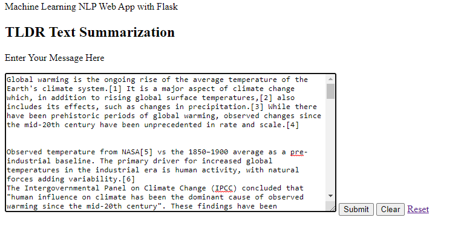
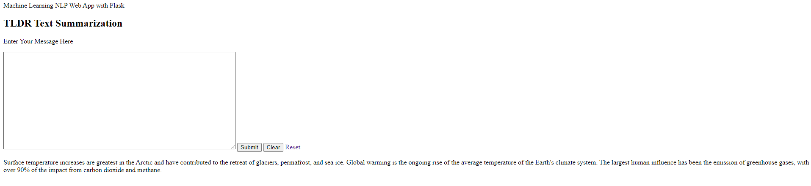
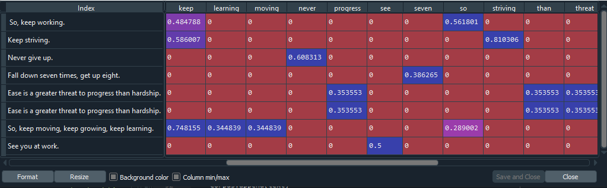
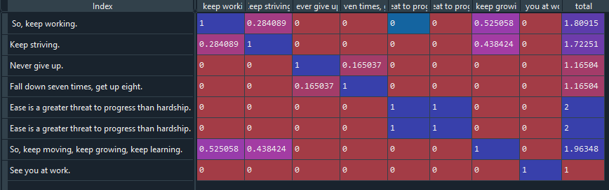

# TLDR Text Summarizer using Natural Language Processing (NLP)
- Text summarization is a subdomain of Natural Language Processing that deals with extracting summaries from huge chunks of text. 
- This text summarizer uses **Term Frequency-Inverse Document Frequency (TF-IDF)** and **Cosine Similarity** 

# Background
- This project was intended to have a deeper understanding of Natural Langauge Processing (NLP) and the different packages of NLP (e.g. NLTK).

# Code and Resources Used
- Python Version 3.7
	- Packages: Pandas, Numpy, nltk, regex, sklearn
- Flask
- Heroku
- HTML

# Term Frequency Inverse Document Frequency (TF-IDF)
- TF-IDF is used for text mining. It uses weights to determine the importance of a word. This weight is a statisical measure to evaluate how important a word is to a document in a collection or corpus.
- Typically, the TF-IDF weight is composed by two terms: the first computes the normalized Term Frequency (TF), in other words, the number of times a word appears in a document, divided by the total number of words in that document
- The second term is the Inverse Document Frequency (IDF), computed as the logarithm of the number of the documents in the corpus divided by the number of documents where the specific term appears.
- For more information about TF-IDF, click [here](http://www.tfidf.com/)
- Below is a simple example of how a TF-IDF matrix would look like:

- From the image, in the first index (So, keep working), we can see that the TF-IDF calculated for each word is given in the matrix.

# Cosine Similarity
- Cosine similarity is a measure of similarity between 2 non-zero vectors of an inner product space. 
- For more reading of cosine simiarity, click [here](https://neo4j.com/docs/graph-algorithms/current/labs-algorithms/cosine/)
- Using cosine similarity, I was able to rank each sentence based on how similar it was compared to the text. 
- After ranking each sentence, all sentences were sorted in descending order, and a summary of the top 3 sentences were chosen as a summary for the text. 

- From the picture above, we can see the sentences ranked based on their Cosine Similarity.

# How to run
- Download app.py and the templates folder.
- Open the command prompt and CD into the folder where app.py and templates folder is held
- type: python app.py

